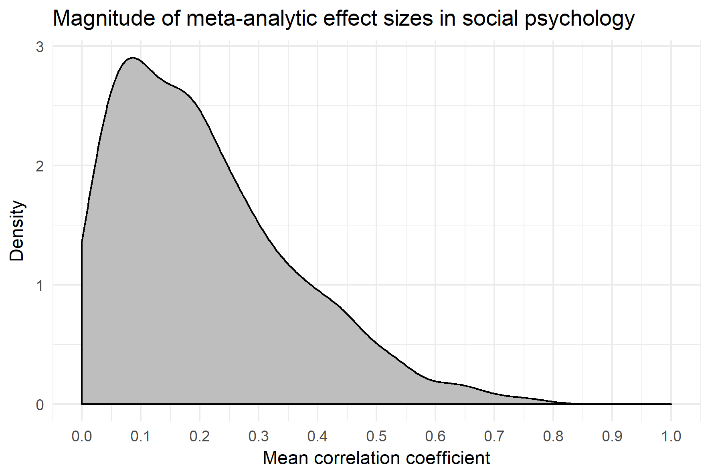

# Effect sizes from one hundred years of social psychology

A total of 474 effect sizes from meta-analyses from social psychology during one hundred years extracted into a tab-separated CSV file.

Thanks to @richarddmorey we now have year as well.



## Headers

- `originalorder` is the order of the effect size as in Richard et al. (2003).
- `Category` is one of 18 categories the effect sizes are grouped into, as in Richard et al. (2003).
- `Description` is a short description of the effect size in question.
- `k` is the number of studies.
- `r` is the mean effect size (Pearson's r).
- `SD` is the standard deviation of the mean effect size. This is the only field with missing values, denoted by `NA`.
- `documentnumber` refers to the document number of the specific meta-analysis. See appendix in Richard et al. (2003).
- `reference` is the reference to the specific meta-analysis.
- `year` is when the meta-analysis was published (extracted from reference).

## Categories

- Aggression
- Attitudes
- Attribution
- Expectancy effects
- Gender roles
- Group processes
- Health psychology
- Helping behavior
- Intergroup relations
- Law
- Leadership
- Methodology
- Motivation
- Nonverbal communication
- Personality
- Relationships
- Social cognition
- Social influence  

## Import into R

```r
df <- read.csv("https://raw.githubusercontent.com/peterdalle/effectsizes/master/soc-psych.tsv",
               header=TRUE, sep="\t", stringsAsFactors=FALSE)

df$Category <- factor(df$Category)

# What is the mean effect size from all meta-analyses?
mean(df$r)

# What is the mean effect size from all meta-analyses in aggression research?
mean(subset(df$r, df$Category == "Aggression"))

# Histogram of all effect sizes.
hist(df$r, breaks = 30)

library(dplyr)
library(ggplot2)

# Reproduce graph in Richard et al. (2003), but use density instead.
df %>% ggplot(aes(r)) +
  geom_density(fill="grey") + 
  scale_x_continuous(limits=c(0, 1), breaks=seq(0, 1, 0.1)) +
  theme_minimal() +
  labs(title="Magnitude of meta-analytic effect sizes in social psychology",
       x="Mean correlation coefficient",
       y="Density")

# Plot all effect sizes per field.
df %>% 
  ggplot(aes(year, r, color=factor(Category))) +
  geom_point() + 
  theme_minimal() +
  labs(title="All effect sizes by pear", color="Field")

# Plot mean effect size by year.
df %>% group_by(year) %>%
  summarize(meanr = mean(r)) %>%
  ggplot(aes(year, meanr)) +
    geom_point() + 
    theme_minimal() +
    labs(title="Mean effect size by pear")    
```

## Reference
Richard, F. D., Bond, C. F., & Stokes-Zoota, J. J. (2003). One Hundred Years of Social Psychology Quantitatively Described. Review of General Psychology, 7(4), 331–363. <https://doi.org/10.1037/1089-2680.7.4.331>
